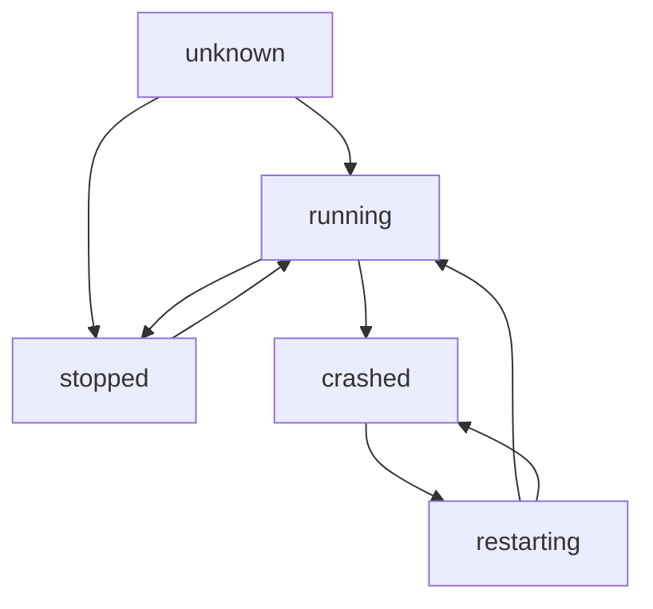

# NSPass Agent 代理进程监控框架

## 概述

NSPass Agent 内置了强大的代理进程监控框架，能够自动检测代理进程状态，在进程异常退出时自动重启，确保代理服务的高可用性。

## 核心特性

### 🔍 **实时监控**
- **定时健康检查**: 按配置间隔定期检查所有代理进程状态
- **并发检查**: 支持同时检查多个代理，提高检查效率
- **超时保护**: 防止检查操作阻塞，设置超时时间
- **状态追踪**: 实时跟踪每个代理的运行状态变化

### 🔄 **智能重启**
- **自动重启**: 检测到进程崩溃时自动尝试重启
- **冷却机制**: 避免频繁重启，设置重启间隔时间
- **重启限制**: 防止无限重启，限制每小时重启次数
- **重试策略**: 重启失败时的智能重试机制

### 📊 **统计监控**
- **重启历史**: 详细记录每次重启的时间、原因、结果
- **性能指标**: 监控检查耗时、重启耗时等性能数据
- **状态统计**: 按状态分类统计代理数量
- **审计日志**: 完整的操作审计和日志记录

### ⚙️ **灵活配置**
- **启用/禁用**: 可以全局或单独控制监控开关
- **参数调节**: 支持细粒度的监控参数配置
- **环境适配**: 提供不同环境的推荐配置
- **动态调整**: 运行时可以调整监控参数

## 配置说明

### 基础配置

```yaml
proxy:
  monitor:
    enable: true              # 是否启用监控
    check_interval: 30        # 检查间隔（秒）
    restart_cooldown: 60      # 重启冷却时间（秒）
    max_restarts: 10          # 每小时最大重启次数
    health_timeout: 5         # 健康检查超时（秒）
```

### 配置参数详解

#### `enable` - 监控开关
- **类型**: `boolean`
- **默认值**: `false`
- **说明**: 控制是否启用代理进程监控功能
- **建议**: 生产环境建议设置为 `true`

#### `check_interval` - 检查间隔
- **类型**: `integer`
- **默认值**: `30`
- **单位**: 秒
- **说明**: 监控器检查所有代理进程状态的间隔时间
- **建议**: 
  - 开发环境: 10-15秒（快速检测）
  - 生产环境: 30-60秒（平衡性能与及时性）
  - 高可用环境: 15-30秒（快速恢复）

#### `restart_cooldown` - 重启冷却时间
- **类型**: `integer`
- **默认值**: `60`
- **单位**: 秒
- **说明**: 代理重启后的冷却期，在此期间不允许再次重启
- **建议**:
  - 快速恢复: 30-45秒
  - 稳定优先: 60-120秒
  - 故障排查: 120-300秒

#### `max_restarts` - 最大重启次数
- **类型**: `integer`
- **默认值**: `10`
- **单位**: 次/小时
- **说明**: 每小时允许的最大自动重启次数，超过则停止自动重启
- **建议**:
  - 开发环境: 15-20次（宽松策略）
  - 生产环境: 5-10次（保守策略）
  - 测试环境: 20-30次（允许频繁重启）

#### `health_timeout` - 健康检查超时
- **类型**: `integer`
- **默认值**: `5`
- **单位**: 秒
- **说明**: 单次健康检查操作的超时时间
- **建议**:
  - 本地检查: 3-5秒
  - 网络检查: 5-10秒
  - 慢速环境: 10-15秒

## 环境配置建议

### 开发环境
```yaml
proxy:
  monitor:
    enable: true
    check_interval: 10      # 快速检测问题
    restart_cooldown: 30    # 短冷却时间
    max_restarts: 20        # 宽松的重启限制
    health_timeout: 3       # 快速超时
```

**特点**: 快速响应，宽松策略，便于开发调试

### 生产环境
```yaml
proxy:
  monitor:
    enable: true
    check_interval: 60      # 平衡性能与监控
    restart_cooldown: 120   # 保守的冷却时间
    max_restarts: 5         # 严格的重启限制
    health_timeout: 10      # 充分的检查时间
```

**特点**: 稳定优先，保守策略，避免频繁重启

### 高可用环境
```yaml
proxy:
  monitor:
    enable: true
    check_interval: 15      # 快速检测故障
    restart_cooldown: 45    # 平衡的冷却时间
    max_restarts: 15        # 适中的重启限制
    health_timeout: 5       # 快速故障检测
```

**特点**: 快速恢复，适中策略，保证服务可用性

## 监控状态说明

### 代理状态类型

- **`unknown`**: 初始状态，尚未检查
- **`running`**: 正常运行
- **`stopped`**: 正常停止
- **`crashed`**: 异常退出（触发自动重启）
- **`restarting`**: 正在重启中

### 状态转换流程



## API接口

### 获取监控状态
```go
// 获取监控器整体状态
status := manager.GetMonitorStatus()

// 获取特定代理的监控状态
state, exists := manager.GetProxyMonitorState("proxy-id")
```

### 控制监控行为
```go
// 启用特定代理的监控
manager.EnableProxyMonitor("proxy-id")

// 禁用特定代理的监控
manager.DisableProxyMonitor("proxy-id")

// 停止监控器
manager.StopMonitor()
```

## 日志和监控

### 关键日志事件

#### 1. 监控启动
```json
{
  "timestamp": "2024-01-15T10:30:00Z",
  "level": "info",
  "message": "组件启动",
  "component": "proxy-monitor",
  "config": {
    "check_interval": 30,
    "restart_cooldown": 60,
    "max_restarts": 10
  }
}
```

#### 2. 进程崩溃检测
```json
{
  "timestamp": "2024-01-15T10:35:00Z",
  "level": "warn",
  "message": "检测到代理进程异常退出",
  "component": "proxy",
  "proxy_id": "ss-001",
  "proxy_type": "shadowsocks"
}
```

#### 3. 自动重启
```json
{
  "timestamp": "2024-01-15T10:35:05Z",
  "level": "info",
  "message": "代理重启成功",
  "component": "proxy",
  "proxy_id": "ss-001",
  "proxy_type": "shadowsocks",
  "duration_ms": 5230,
  "reason": "进程崩溃检测"
}
```

#### 4. 性能指标
```json
{
  "timestamp": "2024-01-15T10:35:30Z",
  "level": "info",
  "message": "性能指标",
  "operation": "proxy_health_check",
  "duration_ms": 125,
  "checked_proxies": 3,
  "performance": true
}
```

#### 5. 审计日志
```json
{
  "timestamp": "2024-01-15T10:35:05Z",
  "level": "info",
  "message": "审计日志",
  "action": "proxy_auto_restart",
  "user": "system",
  "proxy_id": "ss-001",
  "proxy_type": "shadowsocks",
  "reason": "进程崩溃检测",
  "audit": true
}
```

### 状态变更日志
```json
{
  "timestamp": "2024-01-15T10:35:00Z",
  "level": "info",
  "message": "状态变更",
  "component": "shadowsocks",
  "state_from": "running",
  "state_to": "crashed",
  "reason": "代理状态监控检测到变化",
  "state_change": true
}
```

## 监控数据统计

### 统计指标

监控器提供以下统计信息：

```json
{
  "total_checks": 1440,        // 总检查次数
  "total_restarts": 5,         // 总重启次数
  "success_restarts": 4,       // 成功重启次数
  "failed_restarts": 1,        // 失败重启次数
  "last_check_time": "2024-01-15T10:35:30Z"
}
```

### 代理状态分布
```json
{
  "status_count": {
    "running": 2,
    "stopped": 1,
    "crashed": 0,
    "restarting": 0
  },
  "enabled_proxies": 3,
  "total_proxies": 3
}
```

## 故障排查

### 常见问题

#### 1. 监控器未启动
**现象**: 代理崩溃后未自动重启
**检查**:
- 配置中 `proxy.monitor.enable` 是否为 `true`
- 日志中是否有监控器启动信息
- 检查配置文件语法是否正确

#### 2. 重启频率过高
**现象**: 代理频繁重启
**检查**:
- 检查代理程序本身是否有问题
- 调整 `max_restarts` 限制重启次数
- 增加 `restart_cooldown` 延长冷却时间
- 检查系统资源是否充足

#### 3. 重启失败
**现象**: 检测到崩溃但重启失败
**检查**:
- 查看重启失败的具体错误日志
- 检查代理程序文件是否存在
- 检查权限和路径配置
- 检查系统资源限制

#### 4. 检查超时
**现象**: 频繁出现健康检查超时
**检查**:
- 增加 `health_timeout` 设置
- 检查系统负载
- 检查代理程序响应性能
- 调整检查频率

### 调试方法

#### 启用详细日志
```yaml
logger:
  level: "debug"  # 启用详细日志
```

#### 检查监控状态
```bash
# 查看监控器状态（通过API或日志）
curl -s localhost:8080/api/v1/proxy/monitor/status
```

#### 分析重启历史
重启历史包含详细信息，可用于分析故障模式：
- 重启时间点分布
- 重启原因分类
- 重启成功率
- 重启耗时统计

## 性能考虑

### 监控开销

- **CPU开销**: 每次检查消耗少量CPU资源
- **内存开销**: 状态信息和历史记录占用内存
- **IO开销**: 日志写入和进程检查的IO操作

### 优化建议

1. **合理设置检查间隔**: 平衡及时性和性能开销
2. **限制历史记录**: 避免历史记录无限增长
3. **并发检查**: 利用并发检查提高效率
4. **异步操作**: 避免阻塞主流程

## 安全考虑

### 权限控制
- 监控器需要足够权限检查和重启进程
- 建议使用专用用户运行服务
- 限制配置文件访问权限

### 日志安全
- 避免在日志中记录敏感信息
- 配置合适的日志轮转策略
- 保护日志文件访问权限

## 扩展性

### 自定义监控
- 可以扩展监控检查逻辑
- 支持自定义重启策略
- 可以集成外部监控系统

### 集成建议
- 与Prometheus集成收集指标
- 与AlertManager集成报警
- 与ELK Stack集成日志分析

## 最佳实践

1. **环境差异化配置**: 不同环境使用不同的监控策略
2. **渐进式部署**: 先在测试环境验证监控配置
3. **监控监控器**: 监控监控器本身的健康状态
4. **定期审查**: 定期检查重启日志和统计数据
5. **文档记录**: 记录监控配置的原因和预期效果 